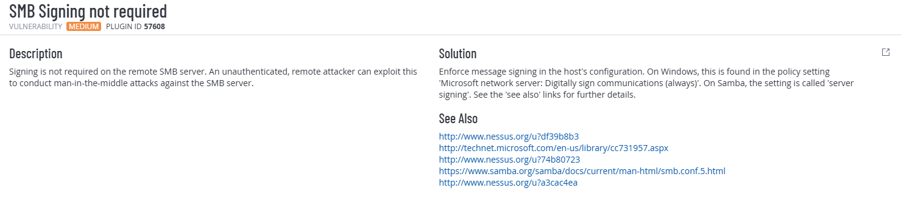
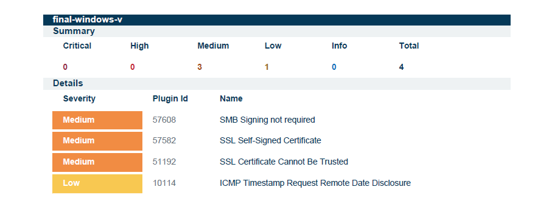

# SMB Signing not required Mitigation (RequireSecuritySignature Enforcement)

This repository contains a PowerShell remediation + verification script that addresses the Tenable/Nessus finding:

- **Plugin ID:** 57608  
- **Name:** SMB Signing not required  

The script enforces SMB message signing by setting:

- `RequireSecuritySignature` (DWORD) = `1`
- `EnableSecuritySignature` (DWORD) = `1`

On Windows systems, scanners require SMB signing to be explicitly **required**, not just enabled.

---

## Why this matters

When **SMB signing is not required**, an unauthenticated remote attacker may be able to perform **man-in-the-middle (MITM)** attacks against SMB traffic.

If message signing is optional instead of mandatory, SMB sessions can potentially be intercepted or tampered with. Vulnerability scanners (such as Tenable/Nessus) will flag the host as non-compliant when signing is not enforced.

### Tenable Plugin Details



---

## Environment

- Target: Windows 11 VM (x64)
- PowerShell Version: 5.1
- Scan Type: Tenable / Nessus
- Privileges Required: Administrator

---

## What the script does

✅ Ensures it is run as **Administrator**  
✅ Applies configuration to both:
- SMB Server (`LanmanServer`)
- SMB Client (`LanmanWorkstation`)

✅ Sets:
- `RequireSecuritySignature` to:
  - `1` when `$secureEnvironment = $true` (secure / recommended)
  - `0` when `$secureEnvironment = $false` (insecure / lab/testing)
- `EnableSecuritySignature` to `1` (explicitly enabled)

✅ Prints a clear **Change Log**  
✅ Verifies registry values  
✅ Validates effective configuration using `Get-SmbServerConfiguration` (when available)  
✅ Outputs a compliance summary (PASS / FAIL)

Script location:

[`scripts/Set-SmbSigningRequired.ps1`](scripts/Set-SmbSigningRequired.ps1)

---

## Registry paths used

The script applies the settings to:

- `HKLM:\SYSTEM\CurrentControlSet\Services\LanmanServer\Parameters`
- `HKLM:\SYSTEM\CurrentControlSet\Services\LanmanWorkstation\Parameters`

Values enforced:

- `RequireSecuritySignature` (DWORD)
- `EnableSecuritySignature` (DWORD)

These correspond to the Local Security Policy settings:

- **Microsoft network server: Digitally sign communications (always)**
- **Microsoft network client: Digitally sign communications (always)**

---

## Usage

1. Open **PowerShell as Administrator**
2. (Optional) Edit the toggle inside the script:
   - `$secureEnvironment = $true`  → enforce mitigation (recommended)
   - `$secureEnvironment = $false` → disable enforcement (lab/testing only)
3. Run:

```powershell
.\scripts\Set-SmbSigningRequired.ps1
```

---

## Technical Validation

The script verifies the configuration by:

- Reading SMB registry values (Server + Client)
- Comparing current values vs desired state
- Printing a compliance summary
- Querying `Get-SmbServerConfiguration` when available
- Returning a PASS/FAIL-style output indicating remediation status

A reboot is recommended for consistent scanner results.

---

## Evidence (Before vs After)

### Before Remediation

Medium severity finding present (Plugin 57608 – SMB Signing not required).  
Total findings: **4**



---

### After Remediation

SMB Signing finding removed.  
Total findings reduced: **4 → 3**


---

## Outcome

- Removed **Medium severity** SMB signing misconfiguration
- Reduced overall vulnerability count
- Automated remediation with built-in verification logic
- Compatible with Windows PowerShell 5.1
- Designed specifically for Tenable/Nessus validation behavior

---

## Notes

- A reboot is recommended after applying changes.
- Use a **credentialed scan** for accurate Nessus validation.
- Enforcing SMB signing may impact legacy devices or applications that do not support signing.
- Removing enforcement will reintroduce the finding.
